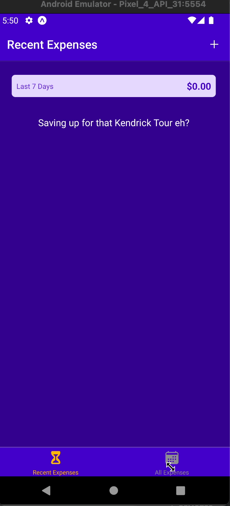

# Expense Tracker App

React Native app to track expenses created w/ Expo CLI, utilizing Context API, axios and Firebase Realtime Database

[React Native Practical Guide](https://www.udemy.com/course/react-native-the-practical-guide/)
## Demo
#### Add Expenses: Enter Amount, Date, and description
- Expenses with dates within the last 7 days will show up on 'Recent Expenses' tab
- All expenses added can be viewed on 'All Expenses' tab

### Update Expenses: Select a previously added expense
- Change any inputs then click 'Update'
- Click the trash icon to delete expense

## To run locally:
- clone repo

- `npm install`

- `npm start `

- `a` to start Android emulator

- `i` to start iOS simulator